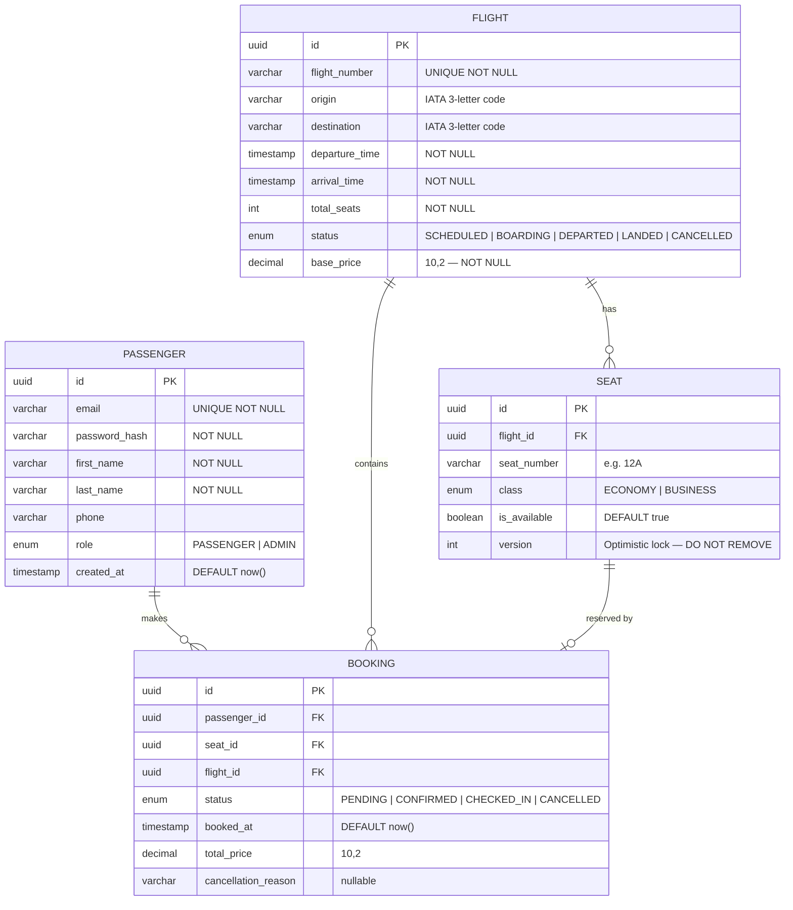

# AeroBook — Entity Relationship Diagram

> **Schema version:** 1.0.0 &nbsp;|&nbsp; **Last updated:** 2025-05-29 &nbsp;|&nbsp; **Status:** In Review

---

## Diagram



---

## Entities

### `PASSENGER`
Represents an end user. Role field drives Spring Security access control — `ADMIN` has access to flight management endpoints, `PASSENGER` to booking endpoints only.

| Column | Type | Constraints | Notes |
|---|---|---|---|
| `id` | `UUID v7` | `PK` | Generated via `@UuidGenerator(style = TIME)` — time-ordered, Hibernate 7 native |
| `email` | `VARCHAR(255)` | `UNIQUE NOT NULL` | Used as login identifier |
| `password_hash` | `VARCHAR(255)` | `NOT NULL` | BCrypt encoded, never plain text |
| `first_name` | `VARCHAR(100)` | `NOT NULL` | — |
| `last_name` | `VARCHAR(100)` | `NOT NULL` | — |
| `phone` | `VARCHAR(20)` | nullable | Optional contact field |
| `role` | `ENUM` | `NOT NULL` | `PASSENGER` \| `ADMIN` |
| `created_at` | `TIMESTAMP` | `DEFAULT now()` | Set by `@CreationTimestamp` |

---

### `FLIGHT`
A scheduled flight between two airports. `flight_number` is the human-readable identifier (e.g. `AB-101`). `origin` and `destination` use IATA 3-letter airport codes.

| Column | Type | Constraints | Notes |
|---|---|---|---|
| `id` | `UUID v7` | `PK` | Time-ordered, `@UuidGenerator(style = TIME)` |
| `flight_number` | `VARCHAR(10)` | `UNIQUE NOT NULL` | e.g. `AB-101` |
| `origin` | `VARCHAR(3)` | `NOT NULL` | IATA code — `DEL`, `BOM`, `CCU` |
| `destination` | `VARCHAR(3)` | `NOT NULL` | IATA code |
| `departure_time` | `TIMESTAMP` | `NOT NULL` | UTC stored, TZ displayed |
| `arrival_time` | `TIMESTAMP` | `NOT NULL` | Must be after `departure_time` |
| `total_seats` | `INT` | `NOT NULL` | Matches number of `SEAT` rows created |
| `status` | `ENUM` | `NOT NULL DEFAULT SCHEDULED` | See state machine below |
| `base_price` | `DECIMAL(10,2)` | `NOT NULL` | Economy floor price |

---

### `SEAT`
One row per physical seat per flight. Generated when a flight is created. The `version` column is the **optimistic lock** — JPA increments it on every update. If two concurrent transactions read the same version and both try to write, the second throws `OptimisticLockException`. This is how the race condition on seat booking is resolved at the database level without pessimistic locks.

| Column | Type | Constraints | Notes |
|---|---|---|---|
| `id` | `UUID v7` | `PK` | Time-ordered, `@UuidGenerator(style = TIME)` |
| `flight_id` | `UUID` | `FK → FLIGHT` | Cascade delete if flight removed |
| `seat_number` | `VARCHAR(4)` | `NOT NULL` | Row + letter, e.g. `12A` |
| `class` | `ENUM` | `NOT NULL` | `ECONOMY` \| `BUSINESS` |
| `is_available` | `BOOLEAN` | `DEFAULT true` | Flipped by booking service |
| `version` | `INT` | `NOT NULL DEFAULT 0` | **Managed by `@Version` — do not set manually** |

---

### `BOOKING`
The join between a `PASSENGER` and a `SEAT` on a specific `FLIGHT`. `flight_id` is intentionally denormalised here — it can be derived via `seat → flight`, but the direct FK avoids a join on every booking lookup and makes cancellation queries simpler.

| Column | Type | Constraints | Notes |
|---|---|---|---|
| `id` | `UUID v7` | `PK` | Time-ordered, `@UuidGenerator(style = TIME)` |
| `passenger_id` | `UUID` | `FK → PASSENGER` | — |
| `seat_id` | `UUID` | `FK → SEAT` | `UNIQUE` — one booking per seat |
| `flight_id` | `UUID` | `FK → FLIGHT` | Denormalised for query performance |
| `status` | `ENUM` | `NOT NULL DEFAULT PENDING` | See lifecycle below |
| `booked_at` | `TIMESTAMP` | `DEFAULT now()` | — |
| `total_price` | `DECIMAL(10,2)` | `NOT NULL` | Locked at time of booking |
| `cancellation_reason` | `VARCHAR(500)` | nullable | Populated on cancellation |

---

## Relationships

| Relationship | Cardinality | Description |
|---|---|---|
| `FLIGHT` → `SEAT` | One-to-many | A flight has many seats; a seat belongs to exactly one flight |
| `PASSENGER` → `BOOKING` | One-to-many | A passenger can make many bookings |
| `FLIGHT` → `BOOKING` | One-to-many | A flight can have many bookings |
| `SEAT` → `BOOKING` | One-to-one (enforced) | A seat can only be booked once — `seat_id` is `UNIQUE` on `BOOKING` |

---

## State Machines

### Flight status

```
SCHEDULED ──► BOARDING ──► DEPARTED ──► LANDED
     │
     └──────────────────────────────────► CANCELLED
```

Transitions are admin-only. A flight in `DEPARTED` or `LANDED` state cannot be cancelled. Bookings on a `CANCELLED` flight are automatically moved to `CANCELLED` status.

### Booking status

```
PENDING ──► CONFIRMED ──► CHECKED_IN
   │             │
   └─────────────└──────────────────► CANCELLED
```

- `PENDING` → `CONFIRMED`: payment / seat lock succeeds
- `CONFIRMED` → `CHECKED_IN`: passenger checks in (within 24h of departure)
- `CONFIRMED` → `CANCELLED`: passenger cancels or flight is cancelled
- `PENDING` → `CANCELLED`: lock fails or timeout

---

## Enums

```java
// model/enums/Role.java
PASSENGER, ADMIN

// model/enums/FlightStatus.java
SCHEDULED, BOARDING, DEPARTED, LANDED, CANCELLED

// model/enums/SeatClass.java
ECONOMY, BUSINESS

// model/enums/BookingStatus.java
PENDING, CONFIRMED, CHECKED_IN, CANCELLED
```

---

## Design Notes

- **UUIDv7 over auto-increment integers** — time-ordered so B-tree index inserts at the tail (no page splits), timestamp embedded for log traceability, and non-sequential so IDs are not enumerable via the API. Generated natively by Hibernate 7 via `@UuidGenerator(style = TIME)` — no custom generator or third-party library needed.
- **`SEAT.version` is non-negotiable** — removing it breaks the concurrency contract. Every write to `SEAT` goes through the service layer which handles `OptimisticLockException` with a retry.
- **Prices locked at booking time** — `BOOKING.total_price` is a snapshot. `FLIGHT.base_price` can change without affecting existing bookings.
- **`ddl-auto: update` in dev, Flyway in production** — schema migrations should be managed by Flyway before moving to any shared environment.